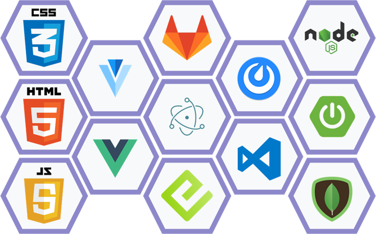
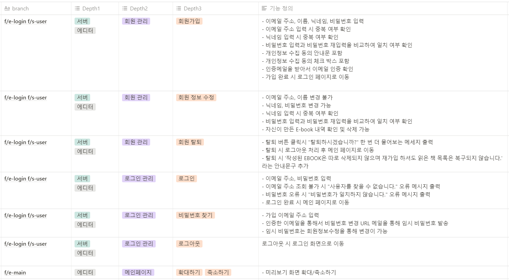
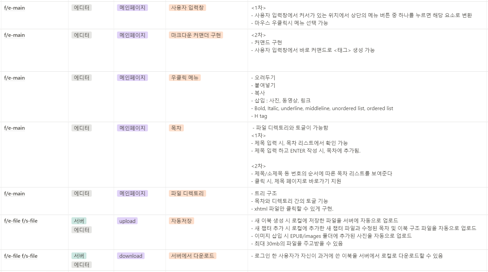
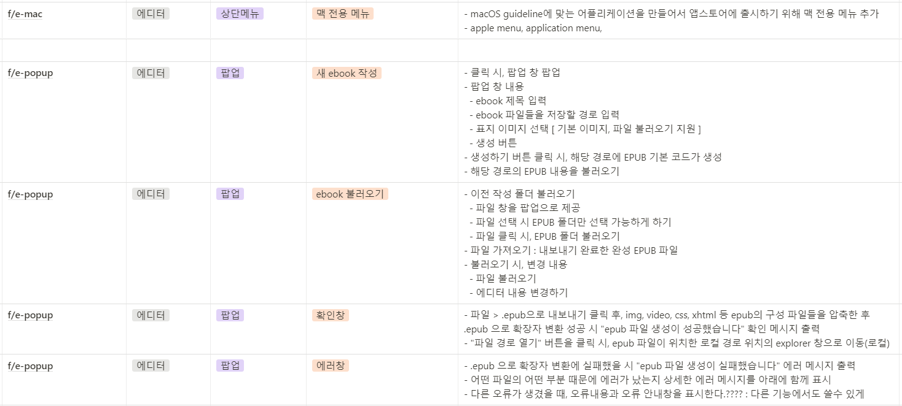
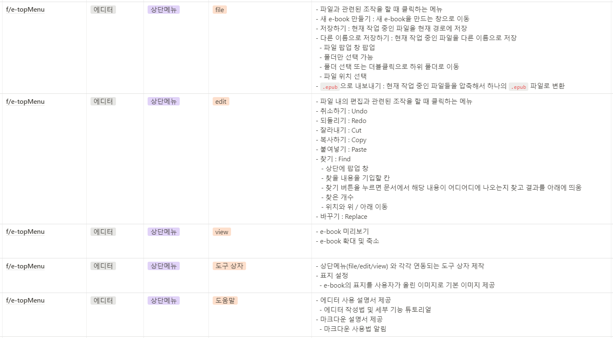
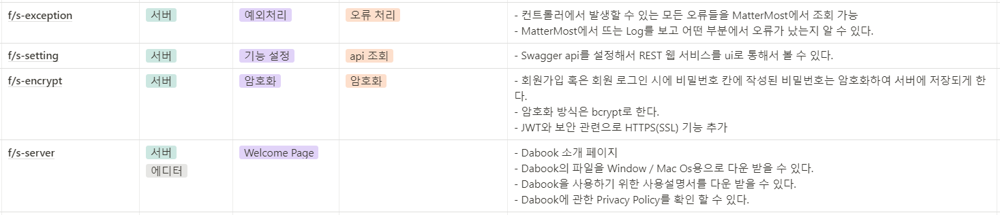

## 소독가들을 위한 다독 장려 프로젝트

## 프로젝트 개요

- 진행기간 : 2021.1.11 ~ (ing)
- 만든이 : 소독가들(강세준, 강채원, 김혜민, 장주빈, 최나현, 최낙훈)
- 기획 배경 : HTML, CSS도 모르는 일반인들도 전자책을 만들수 있게 해보자.
- 목표 : GUI와 단축키로 편하게 사용가능한 Epub Editor만들기.

## Project Stack

## Document

    
 Convention 

    <ul>
        <a href="Document/Convention/Java_Convention.md"><li> Java Convention</li></a>
        <a href="Document/Convention/Vue(Vuex)_Convention.md"><li> Vue(Vuex) Convention</li></a>
    </ul>

    
 Commit 

    <ul>
        <a href="Document/Commit Rule/Git Commit Rule.md"><li> Git Commit Rule</li></a>
    </ul>

    
 Data Model 

    <ul>
        <a href="Document/DataModel/MongoDB Data Model(JSON).md"><li> MongoDB Data Model </li></a>
    </ul>

    
 Wire frame 

    <ul>
        <a href="Document/Wireframe/Project WireFrame Image.md"><li> Wireframe Image </li></a>
    </ul>

    
 Manual 

    <ul>
        <a href="Document/Manual/Editor_Manual(한글).html"><li> Manual(한글) </li></a>
        <a href="Document/Manual/Editor_Manual(영어).html"><li> Manual(영어) </li></a>
    </ul>

## 기능정의서

