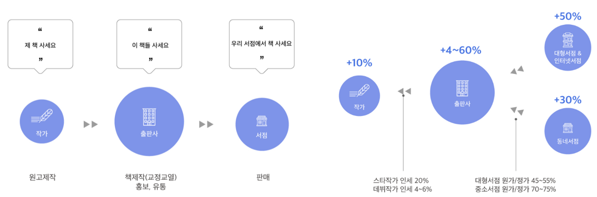
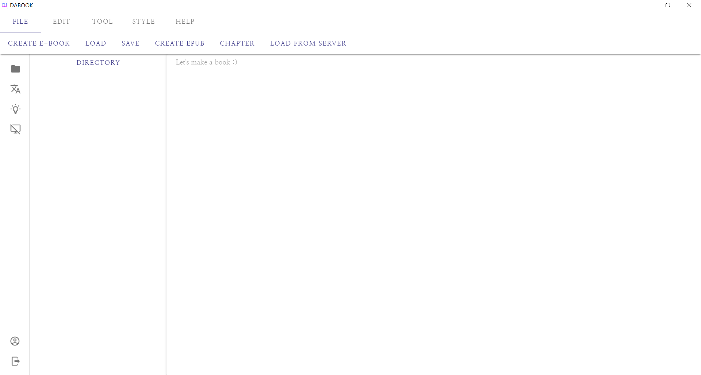
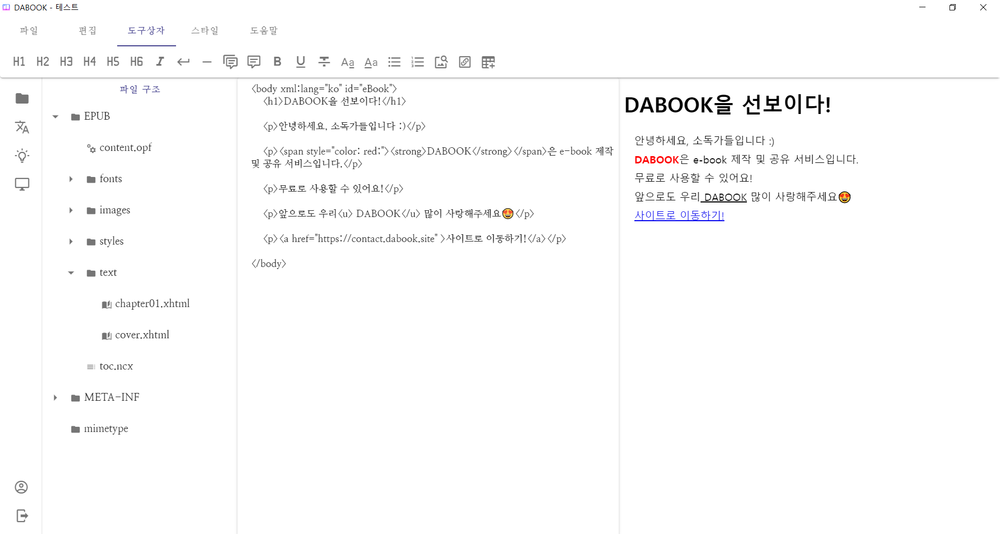
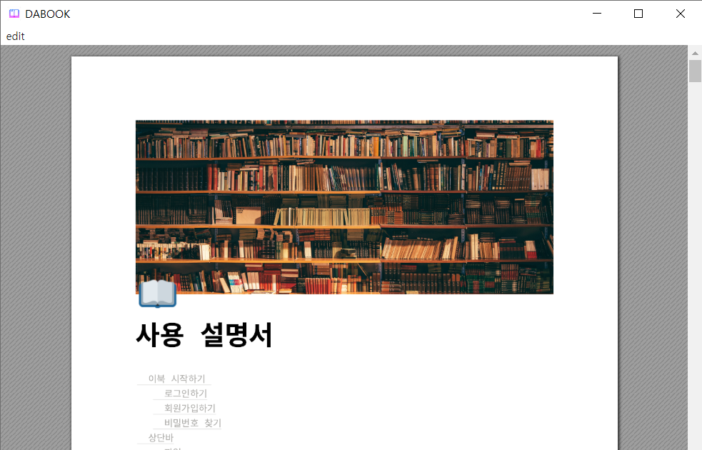

# 📖DABOOK📖

> e-book 제작 및 공유 Desktop Application DABOOK 입니다!
>
> 아래 DABOOK site에서 다운받아 사용해보세요!

## 🎀[DABOOK site](https://contact.dabook.site)

## 🎊[App Store Link](https://apps.apple.com/kr/app/dabook/id1552689997?mt=12)

## 🎨기획 배경

 보통의 출판 프로세스는 작가가 원고를 제작하면 출판사는 유통을 시켜주는 과정을 거칩니다.

이 과정에서 작가의 인세는 **10%**에 불과합니다. 이 문제로 인해 **1인 출판사**가 늘어나고 있지만, **개인의 비용 문제**가 발생합니다. 

우리 소독가들은 이 현실을 체감하여 작가들에게 출판 진입장벽이 낮은 e-book 제작을 제안하게 되었고, 그 결과 e-book 제작 데스크탑 애플리케이션 ***DABOOK***을 기획했습니다.

## 💌소독가들을 위한 다독 장려 프로젝트

## 🍴 Project Stack

## 😍DABOOK 실행화면

- 로그인 화면

- 에디터 초기화면

- e-book 제작 화면

- 사용 설명서 (상단 `도움말` 탭)

## 📃Document

    
 Convention 

    <ul>
        <a href="Document/Convention/Java_Convention.md"><li> Java Convention</li></a>
        <a href="Document/Convention/Vue(Vuex)_Convention.md"><li> Vue(Vuex) Convention</li></a>
    </ul>

    
 Commit 

    <ul>
        <a href="Document/Commit Rule/Git Commit Rule.md"><li> Git Commit Rule</li></a>
    </ul>

    
 Data Model 

    <ul>
        <a href="Document/DataModel/MongoDB Data Model(JSON).md"><li> MongoDB Data Model </li></a>
    </ul>

    
 Wire frame 

    <ul>
        <a href="Document/Wireframe/Project WireFrame Image.md"><li> Wireframe Image </li></a>
    </ul>

    
 Manual 

    <ul>
        <a href="Document/Manual/Editor_Manual(한글).html"><li> Manual(한글) </li></a>
        <a href="Document/Manual/Editor_Manual(영어).html"><li> Manual(영어) </li></a>
    </ul>

## 📽 기능정의서

## 😁DABOOK을 제작한 멋진 소독가들을 소개합니다!

